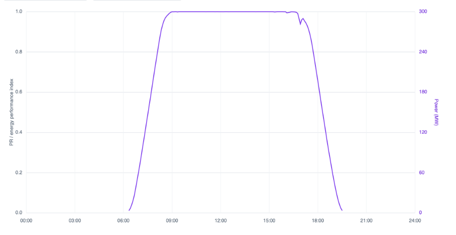
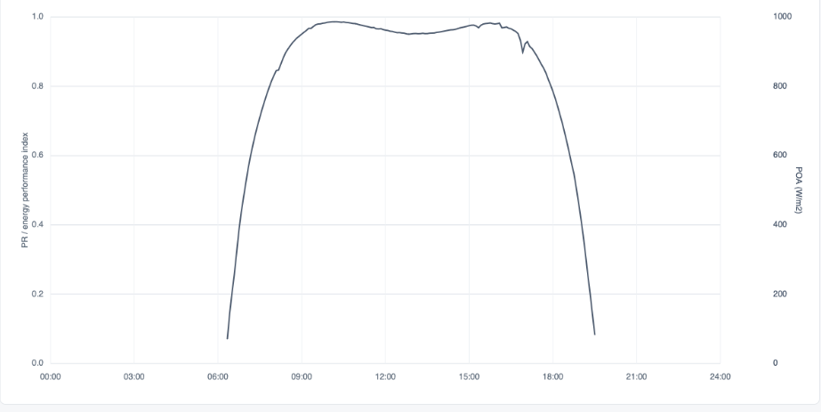
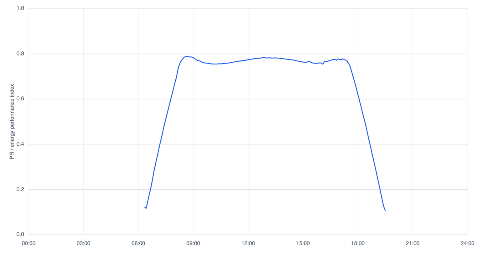
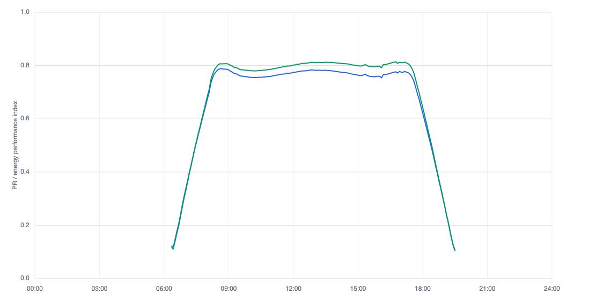

+++
title = "PR vs. EPI"
date = 2026-05-18
weight = 20
aliases = ["writings/pv/pr-vs-epi"]
+++

# Performance Ratio vs. Energy Performance Index

<figure><figcaption>PRcc is a bandaid (Also, AI generated images have improved so much looking through the history of this blog)</figcaption></figure>

## Caveat

At the time of writing, I work for a software company which heavily favors EPI over PR as a performance metric. This one is pretty straight forward though and I think most of the industry would agree with me.  

## Motivation

Kevin Anderson gave a talk at PVPMC 2026 which advocates for the use of Energy Performance Index (EPI) over Performance Ratio (PR) [1].  The premise of the talk is basically that PR and all of it's children are not as good as energy performance index because they don't account for non-linear factors in solar PV performance. This blog post is meant to be an addendum to the talk.  If you didn't get a chance to attend, be sure to check it out once the conference proceedings are released.

## Starting from Scratch

Okay, so lets start with PR.  It's a simple calculation with basically three terms.  The numerator represents the amount of energy exported.  The denominator is how much irradiance there was, scaled by the nominal capacity of the system.  

$$PR = \frac{E_{out}}{P_{STC} \times \left( \frac{H_i}{G_{STC}} \right)}$$

### Variables
* **$E_{out}$**: Total measured AC energy output over the reporting period (kWh).
* **$P_{STC}$**: Total nominal DC nameplate capacity of the PV array under STC (kWp).
* **$H_i$**: Total accumulated plane-of-array (POA) solar irradiation over the period ($\text{kWh/m}^2$).
* **$G_{STC}$**: Reference solar irradiance at STC ($1\text{ kW/m}^2$ or $1000\text{ W/m}^2$).

## An Example

So what does it look like?  Here is a day's worth of data at a real site which has real data from Proximal's fleet.  I've anonymized the name and the data to make the actual project unrecognizable.  

<figure><figcaption>Figure 2:  Here is the power at the site</figcaption></figure>

<figure><figcaption>Figure 3:  It is a clear sky day</figcaption></figure>

<figure><figcaption>Figure 4:  PR for the day is 0.7174</figcaption></figure>

So what does that tell us?  Is a performance ratio (PR) of 0.7174 good?  Is it bad?  Is this system performing as it should be?  I notice that the curve of PR stays pretty level over the middle of the day but in the mornings and the afternoons it dips heavily.  Is that bad?  The shape of the POA curve above is definitely more rounded in the beginning and end of the day relative to the output energy curve.  If we expected the output energy to vary linearly with increasing irradiance then we would expect the curves to have similar shapes and therefore we would expect the PR to stay flat.

Looking at the PR curve, what we know so far is that we are losing a little over 20% of our expected performance if we expected a linear response to irradiance in the middle of the day, and a lot more than that at the beginnings and ends of the day.  Is 20% a reasonable loss relative to linear reponse in the middle of the day?  I like to think that I am a decently proficient performance modeler and to be honest, I'm not quite sure if that is good or bad.

Well, we know that temperature affects the output of a solar module, not only irradiance, so lets try correcting for that next, maybe the steep drops at the beginning and end of the day will go away.

## Bandaid #1

Here is the equation for the temperature corrected performance ratio.  Basically we add a temperature correction term which scales the expected amount downwards if the cell temperature goes above 25 degrees Celsius (Standard Test Conditions).

$$PR_{temp} = \frac{E_{out}}{\sum_{k} \left[ P_{STC} \times \frac{G_k}{G_{STC}} \times \left( 1 + \gamma \cdot (T_{cell, k} - 25) \right) \times \Delta t_k \right]}$$

### Variables
* **$G_k$**: Measured plane-of-array (POA) solar irradiance at time-step $k$ ($\text{W/m}^2$).
* **$\gamma$**: Temperature coefficient of power for the specific PV module ($\%/^\circ\text{C}$ or $1/^\circ\text{C}$, which is a negative value).
* **$T_{cell, k}$**: Measured or modeled PV cell/module temperature at time-step $k$ ($^\circ\text{C}$).
* **$\Delta t_k$**: The duration of the recording time-step $k$ expressed in hours (e.g., $0.25$ for 15-minute intervals).

<figure><figcaption>Figure 6:  PR_tc is added in green.  PR_tc for the day is 0.7407</figcaption></figure>

## Bandaid #2

$$PR_{clip} = \frac{E_{out}}{\sum_{k} \min \left[ P_{STC} \times \frac{G_k}{G_{STC}} \times \left( 1 + \gamma \cdot (T_{cell, k} - 25) \right) , P_{AC, limit} \right] \times \Delta t_k}$$

### Variables
* **$P_{AC, limit}$**: The total maximum rated AC output capacity of the plant's inverter system (kW).
* **$\min[\dots]$**: A mathematical function that selects the smaller of the two values: either the expected unclipped DC power output or the physical maximum AC ceiling of the inverter.

## What's Next?

There are still more non-linearities in the system that we could account for.  We could come up with an equation which takes into account incidence angle modifier, shading, inverter efficiency, spectral correction, etc. We could call it the **PRtccciamcsciecsc** for *Temperature Corrected, Clipping Corrected, IAM corrected, Shading Corrected, Inverter Efficiency Corrected, Spectral Corrected Performance Ratio™.*

But the thing is, smart people have already come up with those equations, they just put them into a performance model. And when you take energy as the numerator and a performance model as the denominator you get (you guessed it) an Energy Performance Index.

---

## References
[1. PVPMC 2026](https://pvpmc.sandia.gov/workshops-and-pubs/workshops/)
