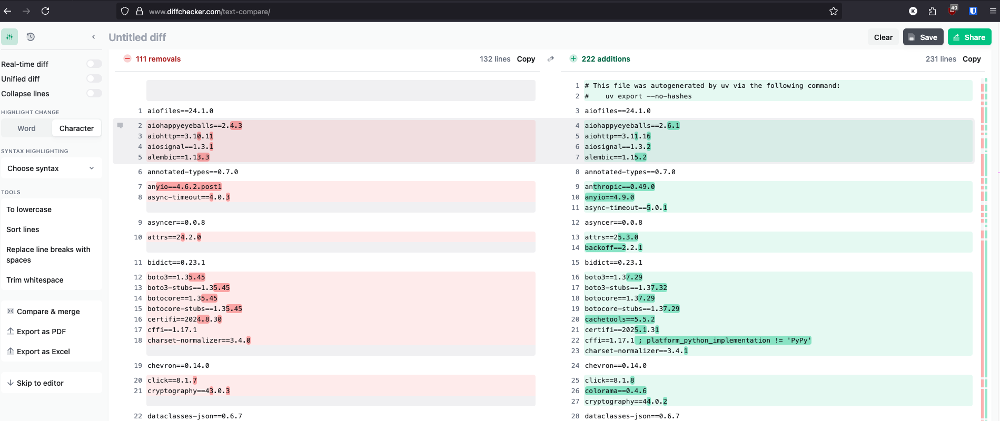

# Writing Python in 2025

## Intro

It's been a while since I've written a blog post.  My wife and I had our first kid not too long ago and it has been a whirlwind of activity.  But I'm back at work now and trying to be as effective as possible in as little time as possible.  I hope these tools can help you as much as they are helping me right now (and I need all the help I can get, so feel free to message me with any tips and tricks you think might be useful).

\
\

## Tools

### UV

I recommended this last year in Writing Python in 2024, and the recommendation still applies.  It's really fast, lets you separate dev depedencies from production ones, and it is really good at untangling dependency hairballs.\
\

### Ruff

Ruff is by the same company that makes uv.  It's a really fast linter/formatter that autofixes all the formatting in your code base.  One of the main benefits of this is that PR reviewers don't need to waste time looking at git diffs between files that only have cosmetic formatting differences.

### Pre-commit

Pre-commit is a python package that can run linters like ruff before every commit, but it can also run arbitrary python code.  One of our requirements in our API at proximal is to use the \* parameter inside of function definitions so that keyword arguments need to be explicitly named in the function call.  I wrote a pre-commit hook to check that we haven't forgotten to do this to cut down in PR review cycle time. (Pro-tip, Claude is really good at writing pre-commit hooks if you need a custom one).\
\

### Zed

I also recommended Zed last year, but this year i'm using it differently.  I've enabled vim motions which allow me to use my mouse less.  I noticed that my right shoulder was getting very tense and sore on days when I had to go back and forth a lot and my physical therapist wife helped me by suggesting I keep my arms shoulder width while working as much as possible.  Using the mouse moves my right arm out of this position and causes my shoulder pain.  Since switching to vim motions and a split keyboard at shoulder width I haven't had any shoulder pain.\

### LazyGit

In line with the vim motions, lazygit has made it so that I don't have to reach for my mouse when running the git commit, git push workflow and also removes a lot of the boilerplate typing you would have to do if you wanted to run it from the command line.  Zed has it's own git commit window that has keyboard shortcuts, but lazygit is more fully featured and lets you tag commits, create new branches, etc.\

### Simulation File Naming

I have a new file structure for simulation code.  In each folder I name my overall controller file c\_placeholder.py and then all of the steps in that simulation s01\_placeholder.py.  The controller just calls all the steps in order and all of my actual logic is in the steps.  This keeps all my code organized into the order that the code is actually called.  Of course, not all code benefits from being organized this way, but when it does it is really useful for being able to understand the logic of simulation code quickly.\
\
I also wrote a script to add a number to the steps so that I can arbitrarily add new steps in the middle of a series of them. \

### Diff Checker

<figure><figcaption></figcaption></figure>

[Diff checker](https://www.diffchecker.com/) allows you to check requirements.txt files line by line, character by character to see the differences.  I don't use this a lot, but it is really useful if you are porting a legacy project over to uv. &#x20;
